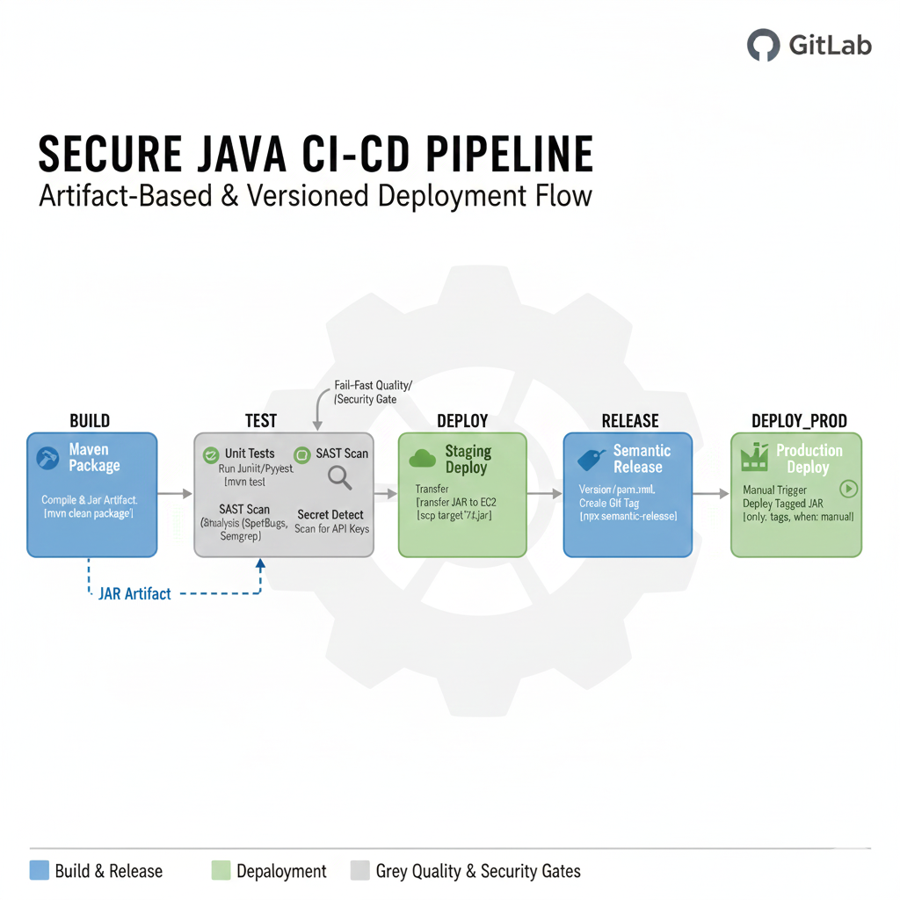

# CI/CD test
## CICD system
For this technical test, I have chosen GitLab CE as it is Open Source, escalable, and it can integrate other tools to achieve quality, security and compliance. It also benefits from the "all-in-one" DevOps lifecycle for free. 

The in-house approach also helps to reduce operations overhead required to effectively control the code pushed to the cloud or using other external accounts like Docker Hub. I could also consider GitHub Actions which is widely adopted and known for its smooth learning curve and zero maintenance setup, and ArgoCD to gain features in the deployments to Kubernetes/EKS. 

I would not consider Jenkins today because, although is widely used, it has proven security flawless, specially in low maintenance plugins, and adds a significant operational costs compared to GitLab CE. 

## Pipeline suggestion

I would start with a standard pipeline with these stages:
 
1. **build** - Compiles code and builds artifacts or docker images.
2. **test** - Although this stage is simpler using the in-house GitLab compared to other approach in the cloud, still it is good to control hardcoded secrets and vulnerabilities in code or Docker images.
3. **deploy** Deploys to Staging, although a temporary environment could be considered before deploying to Staging, I would keep it simple for the outcome of this exercise.
4. **release** Creates a semantic release.
5. **deploy_prod** Deploys the application to production. To avoid accidental deployments to Production I would keep this stage manual for now.

I am assuming the below setup, as a deployment to EKS would significantly differ:

* An EC2 instance running a java application.
* The Java application is configured to use `systemd` service manager.

## Improvement room & GitLab settings

Although this pipeline should suffice for an end-to-end development cycle, other considerations could be implemented depending on the environment and the team feedback:

* Switch from static ssh keys to OIDC.
* Enable audit events to track CICD variables.
* Use protected / masked variables.
* Use AWS KMS or Vault.
* Scope $PROD_IP variable to `prod` environment.
* Protect `prod` deployments to certain users, like development leads.
* Enforce security scans with `allow_failure: false`
* Implement DAST (Dynamic Application Security Testing) for the application test when running on staging.
* Run the application in Docker, ECS or Kubernetes.  
* Add a smoke test after deployment to prod, to automatically roll-off on failures.
* Add license scanning.

## Pipeline test
I have chosen to use `gitlab-ci-local` to test the pipeline because currently I don't have a GitLab instance available to properly test the pipeline. 

```
unzip test-2.zip
brew install maven
brew install --cask docker
brew install gitlab-ci-local
gitlab-ci-local 
``` 

## Pipeline graph


